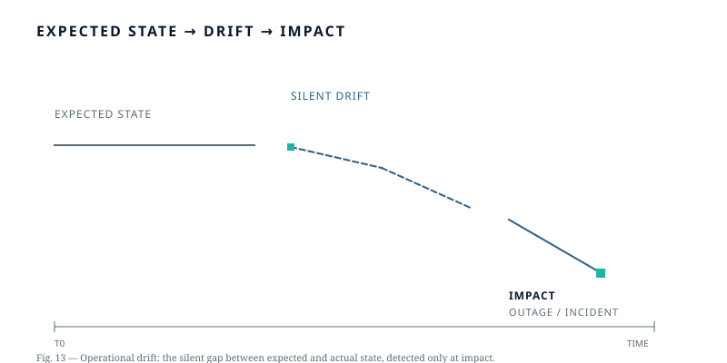

# Diagrammes conceptuels — Beyond the Firewall

> Travail issu du design system (section 7) : trait fin, style blueprint, sans ombres ni dégradés.
> Un fichier SVG par concept du livre 1.

---

## Catalogue

| Fichier | Concept | Chapitre | Usage |
|---------|---------|----------|-------|
| `operational-drift.svg` | Operational Drift — Expected State → DRIFT → Impact | 13 | Section Analyse du chapitre 13 |
| `monitoring-illusion.svg` | Monitoring Illusion — la métrique verte vs l'expérience | 5 | Après le FIELD NOTE du chapitre 5 |
| `permanent-temporary.svg` | Permanent Temporary — l'exception sans expiration | 2 | Section Principe du chapitre 2 |
| `human-spof.svg` | Human SPOF — les compétences dans une seule tête | 4 | Section Analyse du chapitre 4 |
| `availability-resilience.svg` | Availability ≠ Resilience — le premier vrai test | 6 | Section Principe du chapitre 6 |
| `shadow-operations.svg` | Shadow Operations — les deux architectures | 3 | Section Analyse du chapitre 3 |

---

## Conventions

- Dimensions : `viewBox="0 0 800 400"` — ratio 2:1, s'adapte à la largeur de page.
- Trait : `stroke-width="1.5"` (1 pt rendu), pointes de flèches polygonales fines.
- Palette : gris acier `#5A6B7A`, bleu acier `#2C5F8A`, turquoise `#1CB5A0` (marqueur discret), rouge brique `#A83A3A` (danger ponctuel).
- Texte : Sora pour titres et labels ; légende `Fig. N — ...` en Source Serif Pro 10.5 pt, numérotée selon le chapitre d'usage.
- Fond : transparent (la page intérieure fournit l'off-white `#F7F5F0`).

---

## Intégration dans un chapitre

```markdown

```

> **Attention PDF** : XeLaTeX ne comprend pas le SVG natif. Deux options :
> 1. Convertir le SVG en PDF dans `design/diagrammes/pdf/` (Inkscape ou rsvg-convert) et référencer le PDF.
> 2. Activer le package `svg` avec `--shell-escape` dans le template.latex (nécessite Inkscape installé).

---

## Rappel visuel

> Structure abstraite, jamais d'ordinateurs, cadenas ou serveurs (charte graphique, section 1).
> Une alternance texte / visuel toutes les 2-3 pages (design system, section 9).